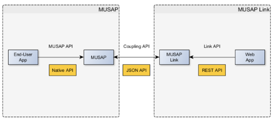
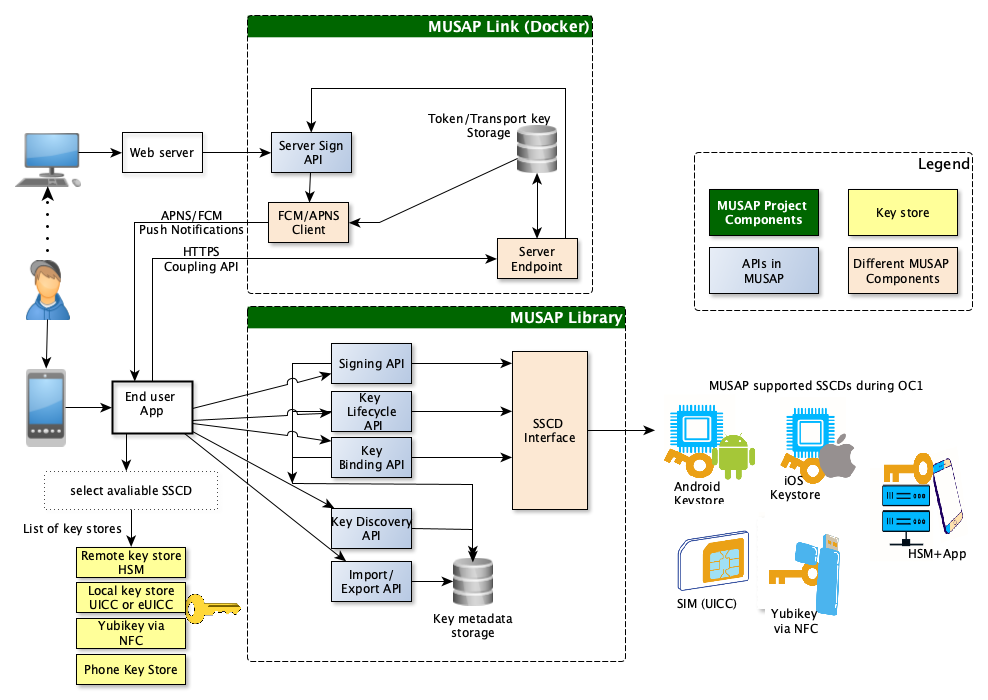
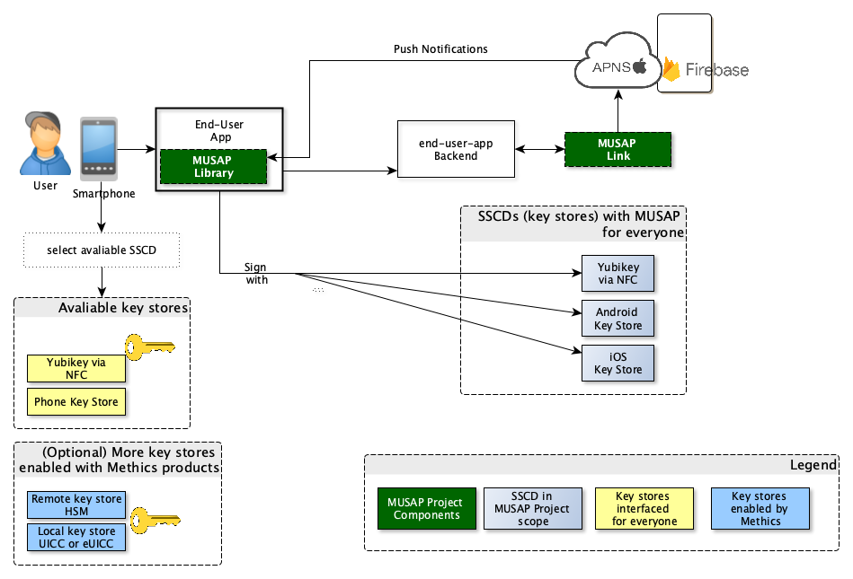

# MUSAP API

This repository documents the APIs related to the MUSAP project. MUSAP consists of the following three APIs:

1. MUSAP API (native iOS/Android)
2. MUSAP Link API (REST/JSON API)
3. MUSAP Coupling API (JSON API)
   

Additionally, the MUSAP Specification can be found [here](https://github.com/methics/musap-api/blob/main/docs/MUSAP_Specification.pdf), and KeyURI specification [here](https://github.com/methics/musap-api/blob/main/docs/KeyURI_Specification.pdf).

Overall MUSAP Architecture is: 

## MUSAP API

The MUSAP API is described in detail in Chapter 11 of the [MUSAP Specification](https://github.com/methics/musap-api/blob/main/docs/MUSAP_Specification.pdf).
Generally it consists of the following parts:

1. Key Discovery API
2. Signature API
3. Key Lifecycle API
4. Key Binding API
5. Import/Export API

## MUSAP Link API

The Link API is an API intended for Application Providers. It can be used to request key generation and signatures from MUSAP libraries that have been integrated with a MUSAP Link server.
The API is described in detail in Chapter 10.1 of the [MUSAP Specification](https://github.com/methics/musap-api/blob/main/docs/MUSAP_Specification.pdf).

The API includes the following end-points:

1. /link
2. /sign
3. /docsign
4. /generatekey
5. /updatekey

Postman API description can also be found  [here](https://documenter.getpostman.com/view/18024908/2s9YkgDk24#8762143f-6872-4610-ba97-7093de13189a).

## MUSAP Coupling API

The Coupling API is used by the MUSAP library to communicate with the MUSAP Link backend.
The API is described in detail in Chapter 10.2 of the [MUSAP Specification](https://github.com/methics/musap-api/blob/main/docs/MUSAP_Specification.pdf).

It includes the following end-points:

1. getdata
2. signcallback
3. enrolldata
4. updatedata
5. linkaccount
6. externalsignature

For all users MUSAP provides at least two keystores to be interfaced with end-user-add:

